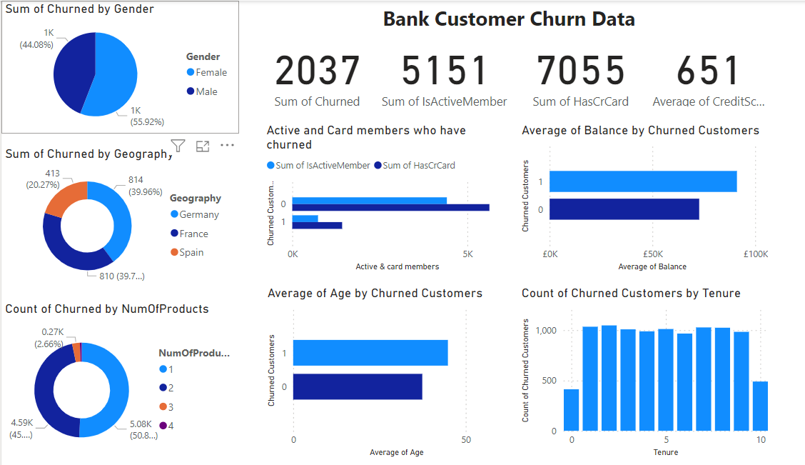

# Datafied-Qualification-Assessment

 # Cusomer Churn Analysis for a Canadian Bank

**Documentation Outline**
---

-[Project Overview](#project-overview)

-[Data Source](#data-source)

-[Tools Used](#tools-used)

-[Data Cleaning & Exploratory Data Analysis](#data-cleaning-&-exploratory-data-analysis)

-[Data Visualization](#data-visualization)

-[Recommendations](#recommendations)

-[Glossary](#glossary)

# Project Overview
---

The financial services industry operates within a dynamic ecosystem, where customer retention stands as a pivotal factor for long-term growth and brand sustainability. A Canadian bank, grappling with customer churn, approached Datafied Technologies for assistance. The bank's challenges include revenue loss, diminished brand loyalty, and a lack of insights into the factors driving customer attrition. To address these issues, Datafied Technologies was tasked with leveraging exploratory data analysis (EDA) through Power BI to delve into a churn database containing records of 10,000 bank customers over a six-month period.

# Data Sources
---

This data was provided by Datafied

# Tools Used
--- 

Microsoft Excel - for primarily housing the data
Power BI - for data cleaning, exploratory data analysis, and visualization

# Data cleaning & Exploratory Data Analysis
---

The data set contains 10,000 different customer IDs with their details with the bank. The following are the insights to be derived from the analysis:

1.	Total number of churned customers
2.	Total number of active members
3.	Total number of customers who have credit card
4.	Average credit score of all customers
5.	Total number of churned customers according to their gender
6.	Geography of churned customers
7.	Number of prpoducts churned customers engage with
8.	Comparison between active members and card-holdong members who have churned
9.	Average age of churned customers compared to non-churned customers
10.The average balance of churned customers compared to non-churned customers
11.	How does the number of years of tenute relate with cutomers churn

# Data Visualization and Findings
---

*Findings*
1. In six months, 20% of customers have churned from the bank

2. 70% of the bank's customers have a credit card with the bank. However, only 50% of the bank's customers are active with the bank.

3. The average credit score of the bank's customer is 651 which is within a normal range.

4. More females (60%) are leaving the bank compared to males.

5. Customers engaging with one or two products of the bank have the highest churn rate.

6. Customers from Germany and France top the list of countries that have churned the most.

7. There is a similar trend for active members and members with credit card to have a low churn rate.

8. The churned customers are more in their middle ages (40-50 years).

9. Churned customers have more balance in their account than non-churned balance.

10. Majority of the churned customers have spent up to 9 years with the bank.

#Recommendations
---

1. Enhance Customer Engagement: Implement targeted communication strategies to increase engagement with inactive members, possibly through personalized offers or financial advice.

2. Diversify Product Offerings: For customers with high balances but low product usage, introduce diversified products that cater to their specific financial needs, encouraging deeper engagement.

3. Loyalty Programs: Develop loyalty programs that reward long-term customers, especially in the older age brackets, to enhance retention.

4. Regional Tailoring of Services: Customize services and products to meet the specific needs and preferences of customers in different geographic regions.

#Glossary
---

These are the column names of the "customerchurn" dataset. This section provides valuable information for analyzing the data and identifying factors that contribute to customers leaving or staying with the bank.

1. CustomerId: A unique identifier for each customer, allowing the bank to track individual customers across the dataset.

2. Surname: The last name of the customer, providing additional identification information.

3. CreditScore: A numerical representation of the creditworthiness of the customer, which could influence their ability to access financial products and services.

4. Geography: The location or region where the customer resides, which may impact their banking needs, preferences, and behavior.

5. Gender: The biological sex or gender identity of the customer, which could potentially influence banking behaviors and needs.

6. Age: The age of the customer, which may correlate with life stage, financial goals, and risk tolerance.

7. Tenure: The length of time the customer has been with the bank, indicating their level of loyalty or engagement.

8. Balance: The amount of money held in the customer's account, reflecting their financial situation and potentially their investment or spending behavior.

9. NumOfProducts: The number of different financial products or services the customer has with the bank, indicating the extent of their relationship with the bank.

10. HasCrCard: A binary indicator (0 or 1) representing whether the customer has a credit card with the bank.

11. IsActiveMember: A binary indicator (0 or 1) representing whether the customer is an active member of the bank, indicating engagement with banking services.

12. EstimatedSalary: An estimation of the customer's salary, providing insight into their income level and potentially their financial stability.

13. Churned: A binary indicator (0 or 1) representing whether the customer has churned (closed their account or ceased using the bank's services within a certain time period). This is the target variable for the churn prediction analysis.

